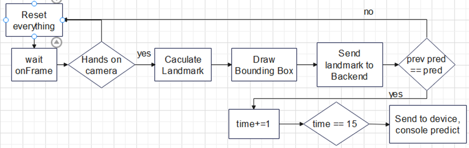
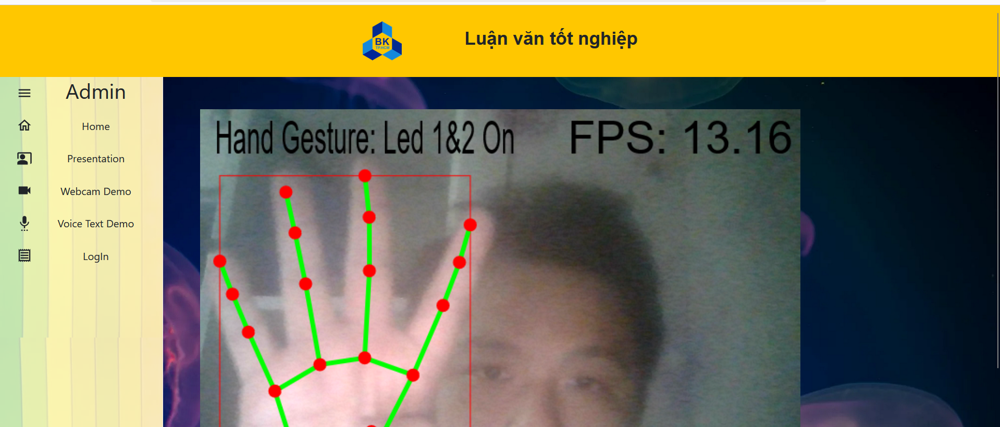

<h3>WEB HAND-AUDIO-TEXT-CLASSIFICATION</h3>

<b>To use the app:</b>
You can use Docker Engine if work with Windows or setup Docker on Linux, after that, clone this repo then use this command:
```
docker compose up -d 
```

<b>Some service you can try:</b>
<p>Hand Gesture App:</p>
<p>In this demo, I use mediapipe Hand to get the hand pose positions, then go through the Transformer Encoder model to get predict. I use this workflow to handle the data:</p>



The Fps is caculated basically based on performaance.now() in js, I use it to caculate when the the time frame start, and the previous time frame start in the onFrame handler of React-webcam.
 You can try it with your left hand in the Webcam Demo section.


<p>Text Classification:</p>
This model is based on the survey between Transformer From Scratch, BERT, LLama, MistralAI, GPT. The result show that BERT is not the best model in classification task if I compare it to LLama, but it's a more lightweight model to deploy on app.
This model is trained on Vietnamese Language, including 28 classes.


0 – ‘Tắt đèn phòng khách’ 
1 – ‘Mở đèn phòng khách’ 
2 – ‘Tắt đèn phòng ngủ’ 
3 – ‘Mở đèn phỏng ngủ’ 
4 – ‘Tắt đèn nhà bếp’
5 – ‘Mở đèn nhà bếp’ 
6 – ‘Đo nhiệt độ phòng’ 
7 – ‘Điều chỉnh quạt quay chậm’
 8 – ‘Điều chỉnh quạt quay vừa’ 
9 – ‘Điều chỉnh quạt chạy nhanh’ 
10 – ‘Tắt quạt’ 
11 – ‘Báo thức, thông báo' 
12 - Mở cửa giúp tôi 
13 - Đóng cửa 
14 - Điều chỉnh máy giặt chế độ thông thường 
15 - Điều chỉnh giặt chế độ sợi bông 
16 - Điều chỉnh chế độ giặt chăn mền 
17 - Tắt máy giặt 
18 - Mở wifi 
19 - Tắt wifi 
20 - Mở máy nước nóng trong nhà tắm
21 - Tắt máy nước nóng trong nhà tắm 
22 - Tắt chế độ tưới cây 
23 - Bật chế độ tươi cây tự động 
24 - tăng âm lượng loa phòng khách 
25 - Giảm âm lượng loa phòng khách 
26 - Tắt loa phòng khách 
27 – Các Th khác


You can try it on the Voice Text Demo section, in side the Text option.

Audio Classification:
This model is based on Wave2vec2.0 and trained based on 9 first class of text demo, and 1 class for silence. I firstly use the noise reduction to make the data easier to be processed, then go through the model, but I have the experiment that the parameter for noise reduction just work well for now in some quiet place and have a very small noise effect, this must be improve in future. And for now, I use websocketIO for the request handler, it has reduced time so much compared to HTTP1.  
